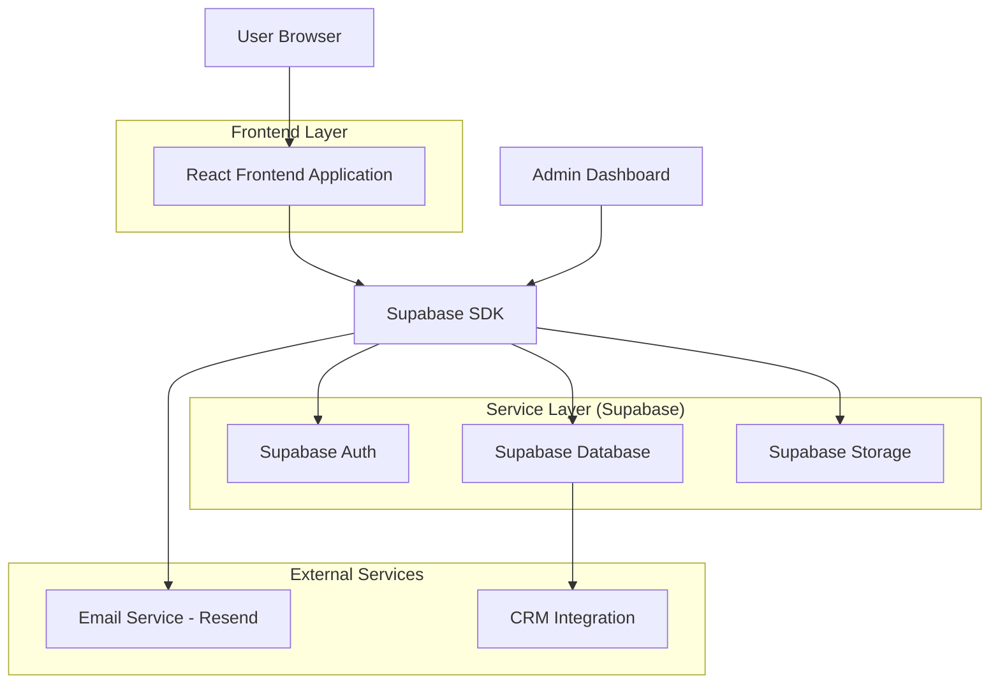
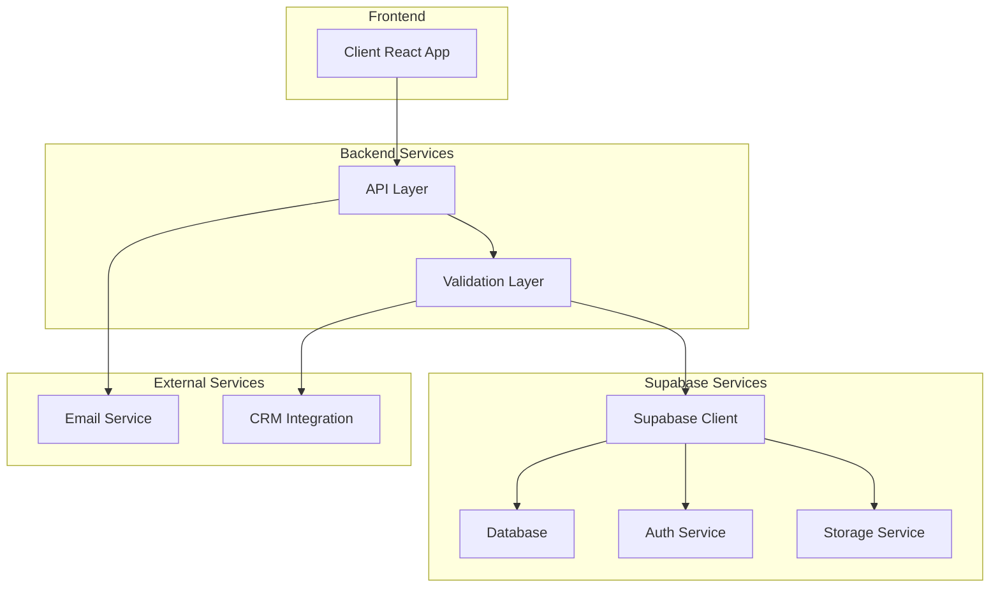
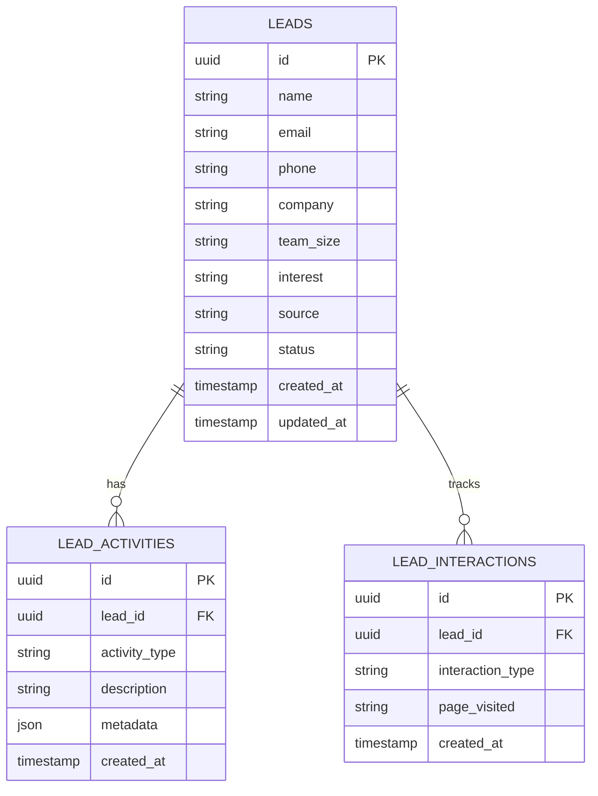

## 1. Architecture design



## 2. Technology Description

- **Frontend**: React@18 + TypeScript + TailwindCSS@3 + Vite
- **Initialization Tool**: vite-init
- **Backend**: Supabase (BaaS)
- **Database**: PostgreSQL (via Supabase)
- **Authentication**: Supabase Auth (magic link + social)
- **Storage**: Supabase Storage (imagens de produtos)
- **Email Service**: Resend (notificações de leads)
- **Styling**: TailwindCSS com componentes customizados
- **Icons**: Lucide React (line icons minimalistas)
- **Forms**: React Hook Form + Zod (validação)
- **Analytics**: PostHog (tracking de conversão)

## 3. Route definitions

| Route | Purpose |
|-------|---------|
| / | Landing page principal com todas as seções |
| /obrigado | Página de confirmação após envio do formulário |
| /api/webhook/lead | Webhook para processar leads no CRM (opcional) |

## 4. API definitions

### 4.1 Lead Capture API

```
POST /api/leads/create
```

Request:
| Param Name | Param Type | isRequired | Description |
|-----------|-------------|-------------|-------------|
| name | string | true | Nome completo do lead |
| email | string | true | Email corporativo |
| phone | string | true | Telefone/WhatsApp |
| company | string | true | Nome da empresa |
| team_size | string | false | Tamanho da equipe (select) |
| interest | string | false | Tipo de solução desejada |
| source | string | false | Origem do lead (landing) |

Response:
| Param Name | Param Type | Description |
|-----------|-------------|-------------|
| success | boolean | Status do envio |
| lead_id | string | ID único do lead |
| message | string | Mensagem de confirmação |

Example:
```json
{
  "name": "Carlos Silva",
  "email": "carlos@empresa.com.br",
  "phone": "(11) 98765-4321",
  "company": "Tech Corp",
  "team_size": "50-100",
  "interest": "Headsets profissionais",
  "source": "landing-page"
}
```

### 4.2 Newsletter Subscription

```
POST /api/newsletter/subscribe
```

Request:
| Param Name | Param Type | isRequired | Description |
|-----------|-------------|-------------|-------------|
| email | string | true | Email para newsletter |

## 5. Server architecture diagram



## 6. Data model

### 6.1 Data model definition



### 6.2 Data Definition Language

**Leads Table (leads)**
```sql
-- create table
CREATE TABLE leads (
    id UUID PRIMARY KEY DEFAULT gen_random_uuid(),
    name VARCHAR(255) NOT NULL,
    email VARCHAR(255) NOT NULL,
    phone VARCHAR(50) NOT NULL,
    company VARCHAR(255) NOT NULL,
    team_size VARCHAR(50),
    interest VARCHAR(255),
    source VARCHAR(100) DEFAULT 'landing-page',
    status VARCHAR(50) DEFAULT 'new' CHECK (status IN ('new', 'contacted', 'qualified', 'converted', 'lost')),
    created_at TIMESTAMP WITH TIME ZONE DEFAULT NOW(),
    updated_at TIMESTAMP WITH TIME ZONE DEFAULT NOW()
);

-- create indexes
CREATE INDEX idx_leads_email ON leads(email);
CREATE INDEX idx_leads_company ON leads(company);
CREATE INDEX idx_leads_created_at ON leads(created_at DESC);
CREATE INDEX idx_leads_status ON leads(status);

-- enable RLS
ALTER TABLE leads ENABLE ROW LEVEL SECURITY;

-- create policies
CREATE POLICY "Allow anon insert" ON leads FOR INSERT TO anon WITH CHECK (true);
CREATE POLICY "Allow authenticated read" ON leads FOR SELECT TO authenticated USING (true);
CREATE POLICY "Allow authenticated update" ON leads FOR UPDATE TO authenticated USING (true) WITH CHECK (true);
```

**Lead Activities Table (lead_activities)**
```sql
-- create table
CREATE TABLE lead_activities (
    id UUID PRIMARY KEY DEFAULT gen_random_uuid(),
    lead_id UUID REFERENCES leads(id) ON DELETE CASCADE,
    activity_type VARCHAR(100) NOT NULL,
    description TEXT,
    metadata JSONB,
    created_at TIMESTAMP WITH TIME ZONE DEFAULT NOW()
);

-- create indexes
CREATE INDEX idx_lead_activities_lead_id ON lead_activities(lead_id);
CREATE INDEX idx_lead_activities_created_at ON lead_activities(created_at DESC);

-- enable RLS
ALTER TABLE lead_activities ENABLE ROW LEVEL SECURITY;

-- create policies
CREATE POLICY "Allow authenticated read" ON lead_activities FOR SELECT TO authenticated USING (true);
CREATE POLICY "Allow authenticated insert" ON lead_activities FOR INSERT TO authenticated WITH CHECK (true);
```

**Newsletter Subscribers Table (newsletter_subscribers)**
```sql
-- create table
CREATE TABLE newsletter_subscribers (
    id UUID PRIMARY KEY DEFAULT gen_random_uuid(),
    email VARCHAR(255) UNIQUE NOT NULL,
    subscribed_at TIMESTAMP WITH TIME ZONE DEFAULT NOW(),
    unsubscribed_at TIMESTAMP WITH TIME ZONE,
    is_active BOOLEAN DEFAULT true
);

-- create index
CREATE INDEX idx_newsletter_email ON newsletter_subscribers(email);
CREATE INDEX idx_newsletter_active ON newsletter_subscribers(is_active);

-- enable RLS
ALTER TABLE newsletter_subscribers ENABLE ROW LEVEL SECURITY;

-- create policies
CREATE POLICY "Allow anon insert" ON newsletter_subscribers FOR INSERT TO anon WITH CHECK (true);
CREATE POLICY "Allow authenticated read" ON newsletter_subscribers FOR SELECT TO authenticated USING (true);
```

### 6.3 Supabase Row Level Security (RLS)

```sql
-- Grant basic access to anon role
GRANT INSERT ON leads TO anon;
GRANT INSERT ON newsletter_subscribers TO anon;

-- Grant full access to authenticated role
GRANT ALL PRIVILEGES ON leads TO authenticated;
GRANT ALL PRIVILEGES ON lead_activities TO authenticated;
GRANT ALL PRIVILEGES ON newsletter_subscribers TO authenticated;

-- Create function for updated_at timestamp
CREATE OR REPLACE FUNCTION update_updated_at_column()
RETURNS TRIGGER AS $$
BEGIN
    NEW.updated_at = NOW();
    RETURN NEW;
END;
$$ language 'plpgsql';

-- Create trigger for leads table
CREATE TRIGGER update_leads_updated_at 
    BEFORE UPDATE ON leads 
    FOR EACH ROW 
    EXECUTE FUNCTION update_updated_at_column();
```