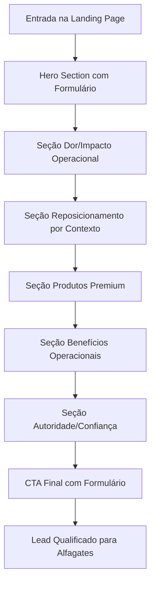

## 1. Product Overview
Landing page premium B2B para Alfagates | Yealink focada em converter empresas em leads qualificados para equipamentos profissionais de comunicação Yealink.

A página transmite autoridade tecnológica, confiabilidade e sofisticação corporativa, posicionando a Alfagates como distribuidor oficial Yealink no Brasil.

## 2. Core Features

### 2.1 User Roles
| Role | Registration Method | Core Permissions |
|------|---------------------|------------------|
| Visitante B2B | Formulário de contato | Visualizar produtos, solicitar consultoria |
| Lead Qualificado | Preenchimento completo do formulário | Receber recomendações personalizadas, contato comercial |

### 2.2 Feature Module
Landing page única com as seguintes seções principais:
1. **Hero Section**: Apresentação impactante com formulário de captação integrado
2. **Seção de Produtos**: Cards premium destacando BH70, A40 e UH42
3. **Seção de Benefícios**: Visualização dos diferenciais operacionais
4. **Seção de Autoridade**: Confiabilidade e expertise da Alfagates
5. **CTA Final**: Conversão final com formulário reforçado

### 2.3 Page Details
| Page Name | Module Name | Feature description |
|-----------|-------------|---------------------|
| Hero Section | Header Premium | Exibir logo Alfagates + Yealink com design clean e botão CTA discreto |
| Hero Section | Headline Impactante | Apresentar: "Comunicação profissional começa pela infraestrutura certa" com subheadline sobre gargalos operacionais |
| Hero Section | Bullets de Valor | Mostrar 3 ícones com: Mais clareza nas interações, Menos ruído e falhas técnicas, Mais performance para equipes |
| Hero Section | Formulário de Captação | Coletar: Nome, Empresa, Email corporativo, Telefone, Tamanho da equipe, Tipo de necessidade |
| Hero Section | Composição Visual | Exibir produtos Yealink (BH70 e A40) com iluminação premium e recorte profissional |
| Seção Dor | Cards de Impacto | Demonstrar perdas operacionais: retrabalho, repetição de chamadas, reuniões menos objetivas, desgaste da equipe |
| Seção Dor | Visual Narrativo | Usar ícones e gráficos para representar ruídos, desconexões e falhas técnicas |
| Seção Reposicionamento | Cards Contextuais | Apresentar 4 cenários: operação intensa, liderança móvel, salas de reunião, colaboração híbrida |
| Seção Produtos | Card BH70 | Exibir imagem grande, categoria "Headset Bluetooth Premium", 3 benefícios: ANC híbrido, múltiplos dispositivos, 35h bateria |
| Seção Produtos | Card A40 | Exibir imagem grande, categoria "Hub de Colaboração All-in-One", 3 benefícios: Android nativo, compartilhamento toque, gerenciamento remoto |
| Seção Produtos | Card UH42 | Exibir imagem grande, categoria "Headset USB Profissional", 3 benefícios: Áudio HD, USB Plug & Play, design confortável |
| Seção Benefícios | Grid de Vantagens | Apresentar 8 cards: clareza comunicação, menos ruídos, conforto prolongado, produtividade, reuniões objetivas, padronização, integração ferramentas |
| Seção Autoridade | Blocos de Confiança | Exibir: especialistas certificados, produtos originais, suporte consultivo, entrega nacional |
| CTA Final | Headline Final | "Se a comunicação é crítica para sua operação, o equipamento também deve ser" |
| CTA Final | Formulário Reforçado | Repetir formulário com campos idênticos ao hero para maximizar conversão |
| Footer | Informações Institucionais | Exibir: logos, contato, redes sociais, disclaimer de distribuidor oficial |

## 3. Core Process
O visitante acessa a landing page através de campanhas B2B e segue o fluxo de conversão otimizado:

1. **Primeira Impressão**: Visualiza hero section com headline impactante e formulário visível
2. **Reconhecimento do Problema**: Identifica com a seção de dor/impacto operacional
3. **Solução Contextualizada**: Compreende a importância de equipamentos adequados por cenário
4. **Exploração de Produtos**: Visualiza cards premium com especificações técnicas relevantes
5. **Confirmação de Benefícios**: Valida vantagens operacionais e diferenciais
6. **Construção de Confiança**: Reconhece autoridade da Alfagates como parceira oficial
7. **Conversão Final**: Preenche formulário após múltiplos touchpoints de valor

## 4. User Interface Design

### 4.1 Design Style
- **Cores Primárias**: Branco predominante, azul petróleo/teal escuro (#1a4d5c), verde tecnológico (#00d4aa)
- **Cores Secundárias**: Cinzas claros (#f8f9fa) para fundos, textos em cinza escuro (#2d3748) e azul profundo (#1a365d)
- **Botões**: Estilo rounded com 8px border-radius, primários em verde tecnológico, secundários outline
- **Tipografia**: Fonte sans-serif moderna (sugestão: Inter ou Helvetica Neue), headings em bold (600-700), body em regular (400)
- **Layout**: Grid base com 12 colunas, cards com cantos arredondados (12px), sombras sutis (0 4px 6px rgba(0,0,0,0.05))
- **Ícones**: Estilo line icons com strokes finos (1.5px), monocromáticos ou com acento verde

### 4.2 Page Design Overview
| Page Name | Module Name | UI Elements |
|-----------|-------------|-------------|
| Hero Section | Background | Gradient escuro de teal para verde escuro com mesh sutil e linhas de conectividade |
| Hero Section | Headline | Fonte 48px bold, branco puro com highlight em verde tecnológico |
| Hero Section | Formulário | Card branco com 24px padding, sombra suave, inputs com 40px height e bordas arredondadas |
| Seção Produtos | Cards | Grid 3 colunas, cards com 320px min-width, imagens de produto em 280x200px com recorte premium |
| Seção Benefícios | Grid | 4x2 layout responsivo, cards com ícones lineares e 16px padding |
| CTA Final | Background | Repetir gradient do hero para coerência visual e impacto de conversão |

### 4.3 Responsiveness
- **Desktop-first**: Otimizado para telas 1440px e 1920px
- **Breakpoints**: 1200px, 768px, 480px
- **Mobile**: Menu hambúrguer para header, cards empilhados verticalmente, formulários full-width
- **Touch optimization**: Botões com mínimo 44px height, espaçamento entre elementos de 8px mínimo

### 4.4 Elementos Visuais Premium
- **Imagens de Produto**: Recortes profissionais com iluminação tipo produto, fundo transparente ou gradient sutil
- **Microanimações**: Hover suaves nos cards (scale 1.02), transições de 0.3s ease-in-out
- **Elementos Gráficos**: Linhas de conexão, ondas de áudio, padrões geométricos corporativos
- **Brilho Sutil**: Gradient mesh em elementos selecionados para aparência tecnológica premium